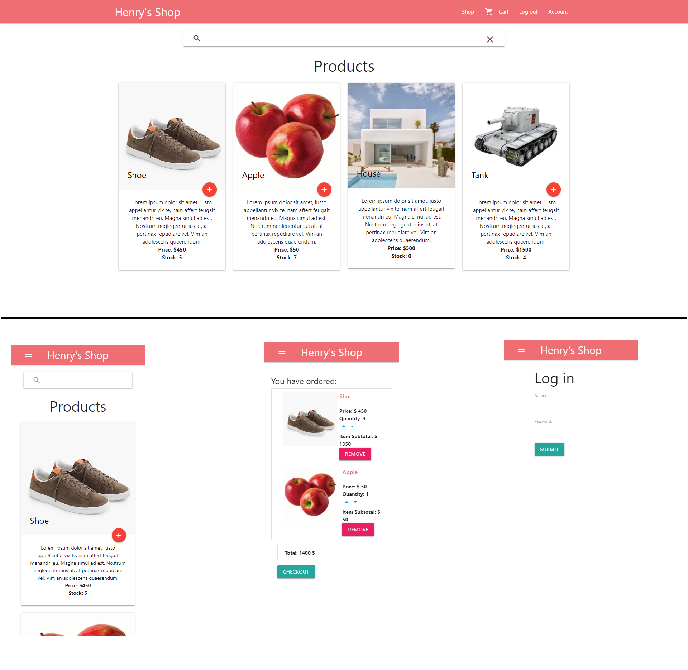

# Web and mobile view

# Henry's Practice E-commerce Shop
This application is used to practice coding skills. 
React as FrontEnd, Express with GraphQL as Backend Server, MongoDB Atlas as Database
Any comments and suggestions will be appreciated.

## Key Library
* React + Redux to build FrontEnd and Cart.
* Node-sass and Materialize sass to handle theme style and responsive design https://materializecss.com/
* React-Route to route between different page.
* Redux-persist to prevent losing cart after refresh page, redux-thunk and axio to make api call. 
* Express + GraphQL to build a simple backend with json data.
* Jsonwebtoken to generate token for authentication.

## Features
* Add products to cart
* Search products from server
* Complete Cart function, add/remove item and checkout
* Login Feature to access protected Account Page
* Responsive Design
* Easy theme change via scss/theme.scss

# Getting started
### Requirements

* Node.js
* NPM

### Package installation
```bash
npm install -g nodemon
npm install
```

### Start the Express Backend
```bash
npm run api
```
The backend will start on http://localhost:8081

The GraphiQL has been turned on at http://localhost:8081/graphql

### Start the React App
 Excute the following command: 
```bash
npm start
```
The application will start automatically in your browser on http://localhost:3000

## Things for me to practise in future
* Automate test
* Implement a Redis db on Server side to verify cart item stock and solve concurrence request issue (like high volume during blackFriday and prevent oversold stock). Maybe move cart to Redis as well for sharing cart among different device
* Try mutate data via GraphQL
* More fun with node-sass to have a button switch theme
* Implement TypeScript.
* Play with AWS to deploy both frontEnd and Backend.


## List of Node Packages Used As Dec 13 2020
    "axios": "^0.21.0",
    "body-parser": "^1.19.0",
    "cors": "^2.8.5",
    "express": "^4.17.1",
    "express-graphql": "^0.12.0",
    "graphql": "^15.4.0",
    "jsonwebtoken": "^8.5.1",
    "lodash": "^4.17.20",
    "mongoose": "^5.11.7",
    "node-sass": "^5.0.0",
    "react": "^16.14.0",
    "react-dom": "^16.14.0",
    "react-notifications-component": "^3.0.3",
    "react-redux": "^6.0.1",
    "react-router-dom": "^4.3.1",
    "react-scripts": "2.1.1",
    "redux": "^4.0.5",
    "redux-persist": "^6.0.0",
    "redux-thunk": "^2.3.0"
